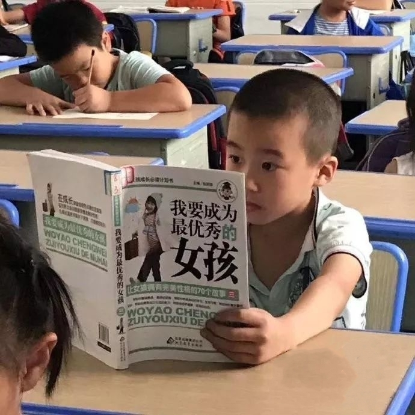

# 这是我的第一篇博客
### 下面是一些个人介绍
### 1、我的爱好
* 看书
* 健身
* 养生

### 2、喜欢的明星
* [李宇春](https://weibo.com/liyuchun)
* [白敬亭](https://weibo.com/u/2112496475)
* [王嘉尔](https://weibo.com/jacksonwangG7?is_hot=1)
### 3、分享最近看到的一句话 
If you don't turn your life into a story, you just become a part of someone's story.
### 4、对自己的期望
不要好高骛远，不要心浮气躁，不要自欺欺人。



### 随便写点什么
这是jQuery  
`$(document).ready();`
这是HTML
```html
<!DOCTYPE html>
<html lang="en">
<head>
    <meta charset="UTF-8">
    <meta name="viewport" content="width=<device-width>, initial-scale=1.0">
    <title>Ann's first blog</title>
</head>
<body>
    <h1>Everything will be better</h1>
    <p>找啊找啊找工作，找到一个好工作！</p>
</body>
</html>
```
这简直是满分作文哈哈哈！

未经允许，不得转载!


